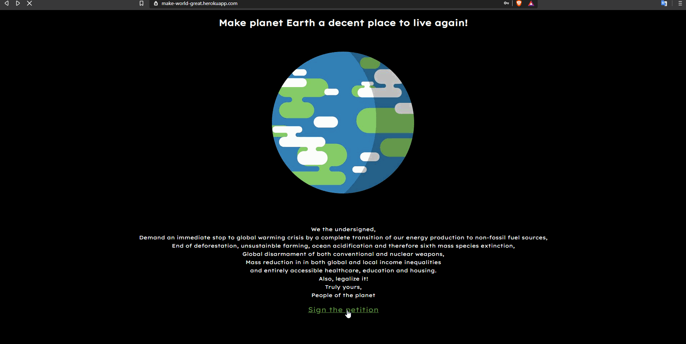

# Make planet Earth a decent place to live again!

is Handlebars.js based semi-parodic online petition done during a course at [SPICED Academy](https://www.spiced.academy/program/full-stack-web-development/).

---

## Preview

## Sign on Heroku!

https://make-world-great.herokuapp.com/

## Features

- user registration
- signature canvas, with delete and redo option
- simple profile, that can be edited
- visualized database of other users that signed the petition and their public info
- city based filter
- 3 level cookie permission system
- CSURF, log in and log out

## Tech

CSS, JavaScript, Handlebars, Canvas, Express, PostgreSQL, Heroku